<h1 align="center">🎓 CalculaPromedio.cl</h1>

<p align="center">
  <strong>Plataforma SaaS educativa para estudiantes chilenos</strong><br/>
  <em>Calculadoras · ejercicios PAES · teoría · flashcards SM-2 · tutor con IA · gamificación con XP y niveles</em>
</p>

<p align="center">
  <a href="https://calculapromedio.cl">
    
  </a>
</p>

<p align="center">
  
  
  
  
  
</p>

<p align="center">
  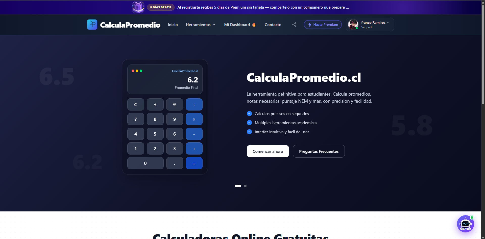
</p>

---

## 📖 Sobre el proyecto

**CalculaPromedio.cl** es una plataforma SaaS educativa en producción, orientada a estudiantes chilenos de enseñanza media y preuniversitarios. Combina herramientas de cálculo académico (promedios, puntaje NEM, notas necesarias) con un **sistema completo de preparación para la PAES**: teoría estructurada, ejercicios tipo prueba, flashcards con repetición espaciada, un **tutor con IA** y una capa de **gamificación** (XP, niveles, rachas, logros, ranking).

Modelo **freemium** con prueba de 5 días sin tarjeta y suscripción Premium procesada vía **Flow.cl**.

Este repositorio es un **showcase documental** del proyecto. El código fuente es privado por motivos de monetización. Para ver el producto funcionando, visita **[calculapromedio.cl](https://calculapromedio.cl)**.

> 💼 **Rol:** Desarrollador único — producto, backend, frontend, infraestructura, pagos, SEO, gamificación y despliegue.

---

## 🎯 ¿Qué resuelve?

Estudiantes chilenos necesitan **tres cosas** que suelen vivir en apps separadas:

1. **Calcular rápido** promedios, notas necesarias y puntaje NEM — las calculadoras genéricas no entienden la escala 1.0 a 7.0 ni la lógica del NEM.
2. **Estudiar y practicar** teoría + ejercicios tipo PAES con corrección automática y análisis de debilidades.
3. **Mantener el hábito** de estudio con un sistema que motive (racha, XP, ranking semanal, desafío diario).

**CalculaPromedio.cl** une las tres en una sola plataforma con lenguaje y contexto 100% chileno (NEM, PAES, ejes temáticos, puntaje de corte, formato DEMRE).

---

## ✨ Capa pública — Herramientas gratuitas

### 🧮 47 calculadoras educativas

Suite completa de calculadoras académicas, cada una optimizada para SEO con schema JSON-LD `SoftwareApplication`. Incluye un **widget flotante del Tutor IA** disponible desde cualquier calculadora para resolver dudas en el momento.

<p align="center">
  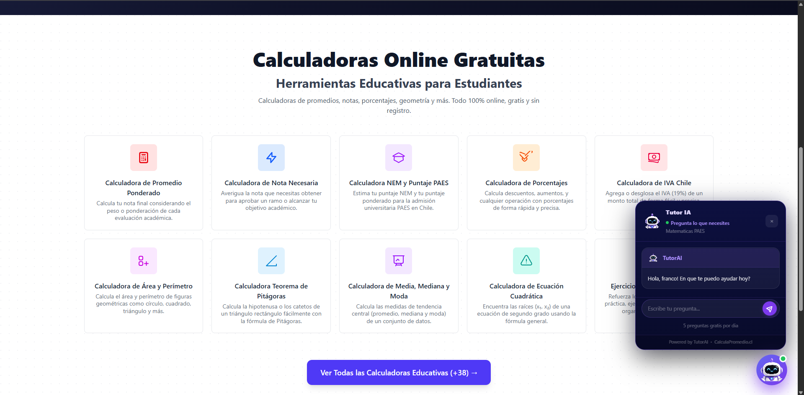
</p>

### 📂 Directorio de calculadoras

Organizadas por categoría (Notas y Promedios, Preparación PAES, Geometría, Probabilidad, etc.) para que el usuario encuentre rápido lo que necesita.

<p align="center">
  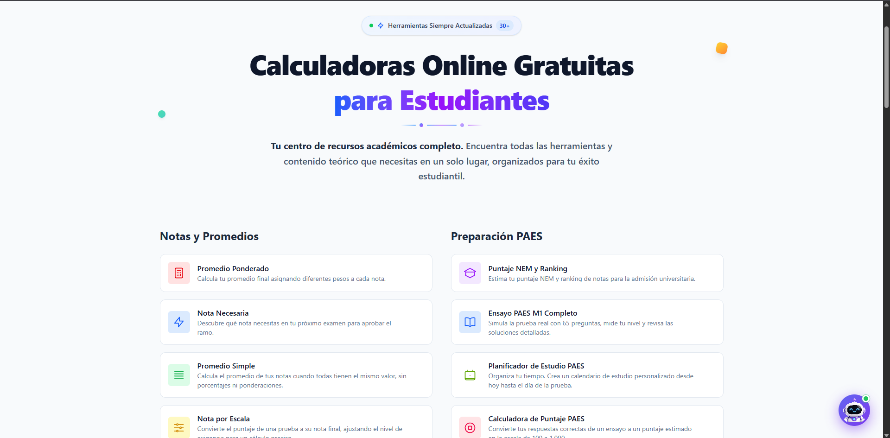
</p>

---

## 🎓 Capa Premium — Preparación PAES

### 📊 Dashboard del estudiante

Panel central con:
- **Desafío diario** (10 preguntas PAES para mantener la racha)
- **Countdown al examen** PAES
- **Sistema de logros** (Primer ejercicio, Racha de 3 días, 10 ejercicios, Logro 70%, Semana activa)
- **Accesos rápidos** a Banco, Simulacros, Tutor IA, Teoría, Actividades
- **Progreso visual** con gráfico de evolución semanal

<p align="center">
  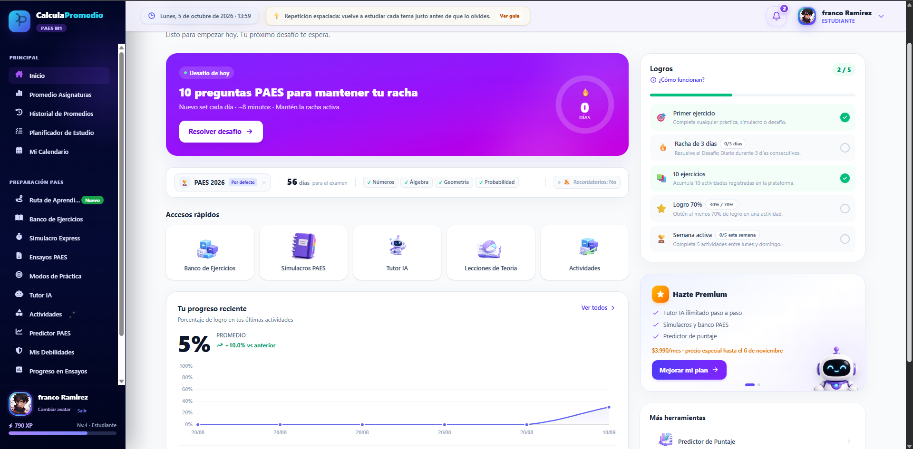
</p>

### 📅 Planificador y calendario de estudio

Calendario con sesiones programadas por día, contador de **días hasta la PAES**, sesiones completadas vs. pendientes, racha actual y plan diario personalizado.

<p align="center">
  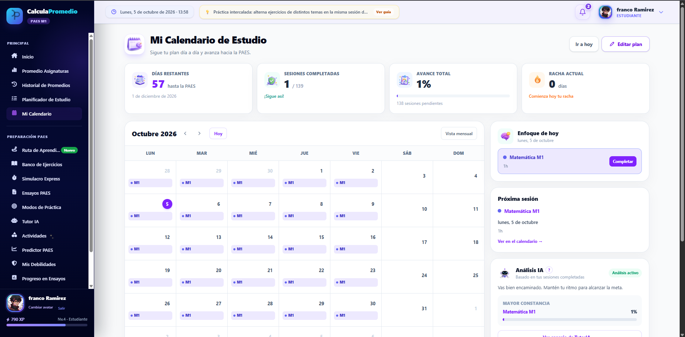
</p>

### 📝 Ensayos oficiales PAES

Simulacros completos de **M1** (Competencia Matemática Obligatoria, 65 preguntas) y **M2** (Avanzada, 55 preguntas). Incluye:
- Corrección automática con análisis detallado
- **Predicción de puntaje** basada en últimos 3 intentos
- Historial de ensayos con comparación
- Evolución reciente del puntaje
- Consejos de estudio personalizados

<p align="center">
  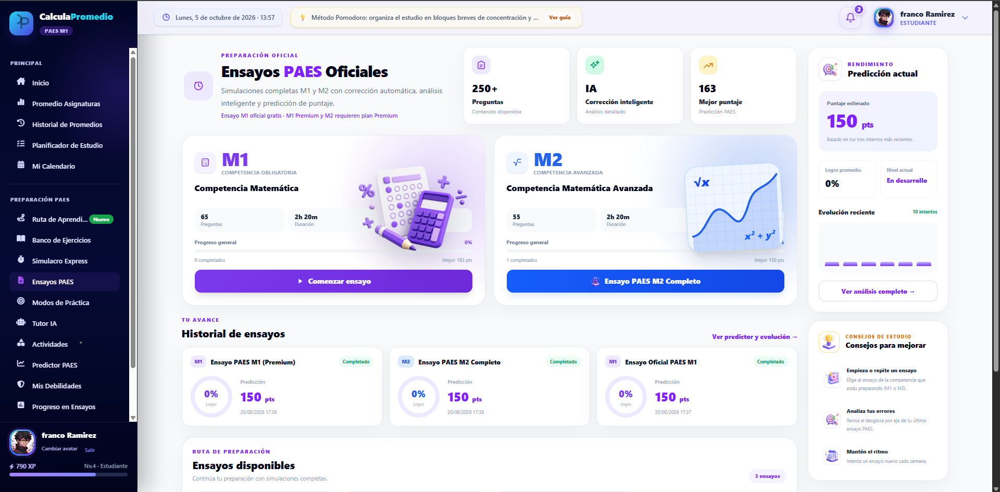
</p>

<p align="center">
  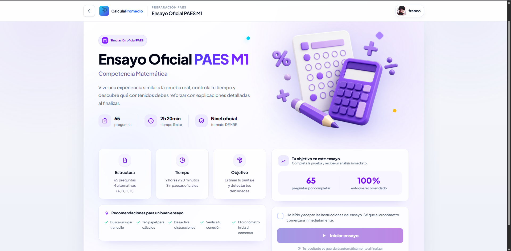
</p>

### 🏦 Banco de ejercicios por eje temático

242 ejercicios organizados por **4 ejes temáticos** (Álgebra, Probabilidad y Estadística, Números, Geometría) y **3 niveles de dificultad** (Fácil, Medio, Difícil). El sistema:
- Detecta tu **debilidad a reforzar** y la destaca
- Muestra rendimiento por eje (%)
- Recomienda próximos ejercicios según respuestas pasadas
- Guarda cada respuesta para análisis posterior

<p align="center">
  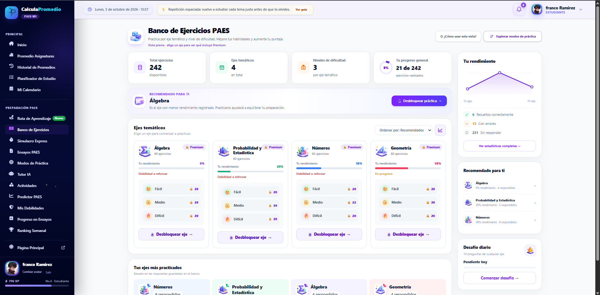
</p>

### 🗺️ Ruta de aprendizaje gamificada

Vista tipo **videojuego** del progreso. El estudiante avanza por una ruta visual (montaña PAES) desbloqueando lecciones y ejes. Incluye racha diaria, XP acumulados, nivel actual y los ejes más practicados.

<p align="center">
  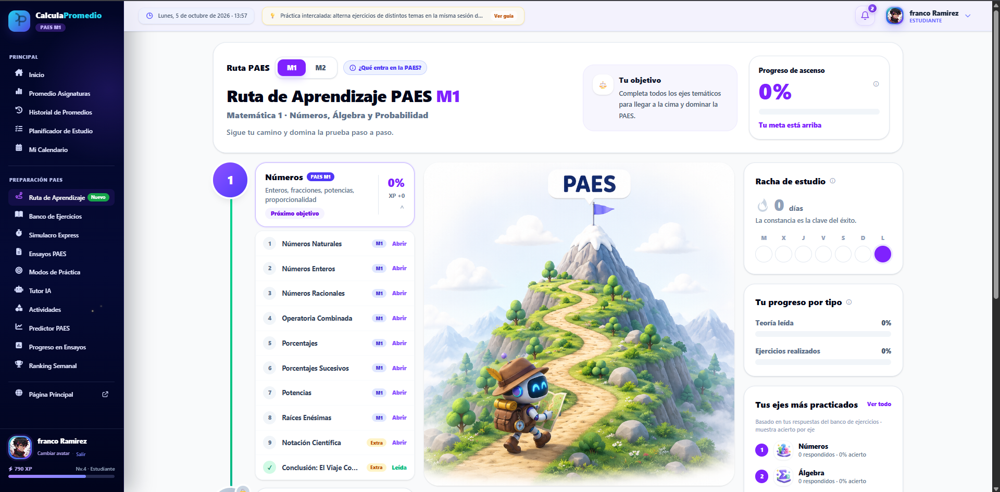
</p>

### 📚 Lecciones de teoría estructuradas

36 lecciones divididas en 4 temas (Números, Álgebra, Geometría, Probabilidad). Cada lección tiene:
- Contenido explicado paso a paso
- Infografía ilustrativa
- Ejemplos resueltos (JSON estructurado)
- Fórmulas clave
- Video embebido + PDF descargable
- Tutor IA integrado para preguntas sobre la lección
- 9 secciones navegables (idea central, qué son, para qué sirven, cómo resolver, errores frecuentes, resumen, etc.)

<p align="center">
  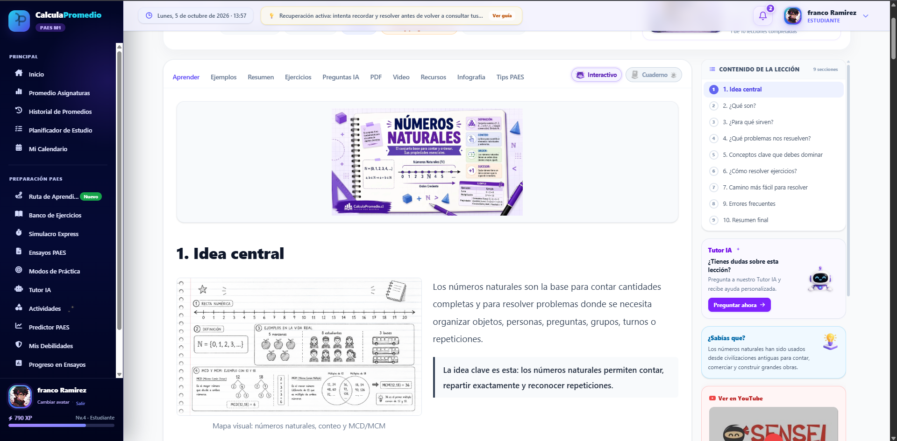
</p>

### 🤖 Clases interactivas con Tutor IA + pizarra

Las lecciones incluyen **actividades interactivas** donde el **tutor IA** actúa como profesor virtual: explica un concepto por pantalla, da pistas contextuales, traduce a lenguaje fácil y acompaña paso a paso. El usuario gana **XP** por completar cada actividad.

<p align="center">
  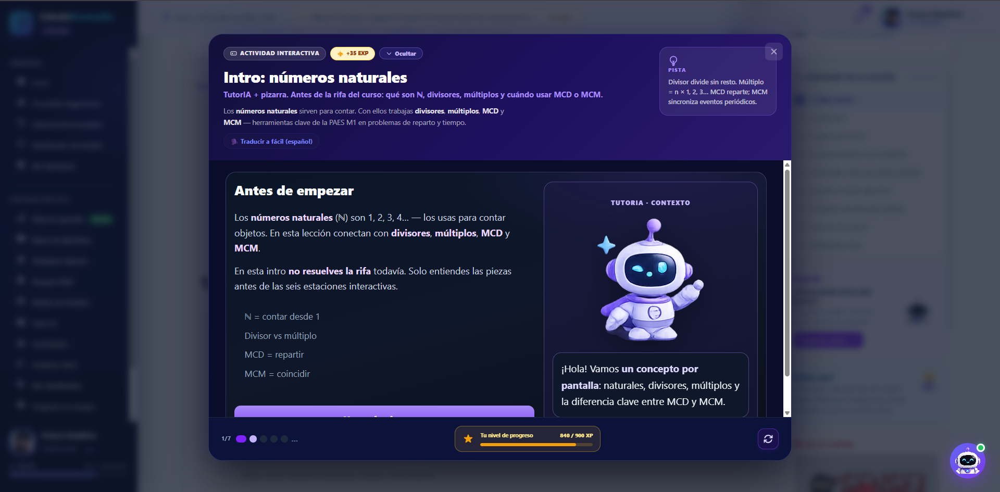
</p>

---

## ✨ Resumen de funcionalidades

| Capa | Qué ofrece |
|---|---|
| 🧮 **Calculadoras** | 47 herramientas: promedio simple/ponderado, nota necesaria, puntaje NEM, ranking, área, perímetro, Pitágoras, ecuación cuadrática, IVA, media/mediana/moda, y más |
| 📚 **Teoría** | 36 lecciones en 4 temas con video, PDF, infografía y Tutor IA integrado |
| 📝 **Banco de ejercicios** | 242 ejercicios por tema + dificultad, con análisis de debilidades |
| 📊 **Ensayos oficiales** | Simulacros M1 (65 preguntas, 2h 20min) y M2 (55 preguntas), formato DEMRE |
| 🧠 **Flashcards** | Repetición espaciada con algoritmo **SM-2** (base de Anki) |
| 🤖 **Tutor IA** | Chat con IA que resuelve ejercicios paso a paso en ambos sistemas |
| 🎮 **Gamificación** | XP, niveles, rachas, logros, ranking semanal, desafío diario |
| 📅 **Planificador** | Calendario de estudio con countdown PAES y sesiones programadas |
| 📈 **Analytics del estudiante** | Debilidades por eje, predictor de puntaje PAES, histórico |
| 💎 **Freemium** | 5 días gratis sin tarjeta + Premium con pagos vía Flow.cl |
| 🛠️ **Panel admin** | KPIs, ingresos, analytics por geolocalización, mapa global |

---

## 🧱 Stack técnico

### Backend


- **Laravel 12** (versión actual, no legacy)
- **Blade** como motor de plantillas con layout dual (público / dashboard)
- **Autenticación custom** — sin Breeze ni Jetstream, implementación propia + OAuth Google con Laravel Socialite
- **~20 controladores** organizados por dominio
- **20+ modelos Eloquent** con relaciones completas
- **50 migraciones** · **10 seeders** con 35K+ líneas de contenido educativo

### Frontend


- **Tailwind CSS** vía plugin de navegador (CDN)
- **Alpine.js** para interactividad ligera (dropdowns, modales, widget del tutor flotante)
- **FullCalendar** para el calendario de estudio
- **JavaScript vanilla** para las calculadoras
- Diseño **mobile-first**

### Base de datos


Separación limpia por dominio: auth (`users` + `user_metadata` + `perfil`), ejercicios dual (`questions`/`options` para ensayos + `bank_questions`/`bank_options` para banco), teoría (`teoria` + `usuario_lectura_teorias`), flashcards (`flashcards` + `user_flashcards` con campos SM-2), pagos (`pagos` con `flow_token` único).

### Integraciones externas


- **Modelo de IA externo** vía API REST — tutor IA conversacional
- **Flow.cl** — pagos chilenos vía API REST con firma **HMAC-SHA256**
- **Google OAuth 2.0** via Laravel Socialite (stateless)
- **stevebauman/location** — geolocalización de IPs
- **SMTP** para correos transaccionales

---

## 🏗️ Arquitectura

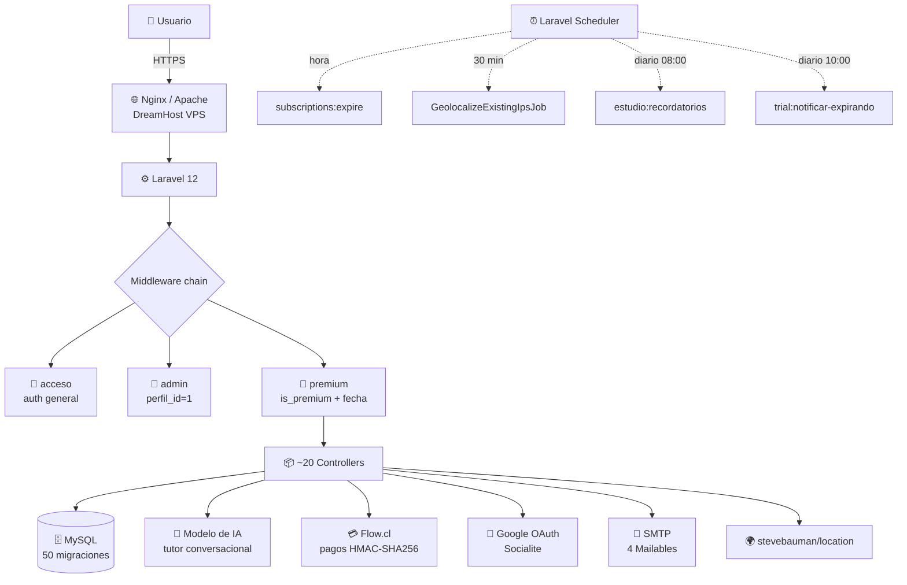

---

## 💡 Decisiones técnicas destacadas

### 🎮 Gamificación como feature de producto, no como decoración

El sistema de **XP, niveles, rachas, logros y ranking semanal** no está pegado al final — está integrado desde el modelo de datos. Cada acción del usuario (resolver ejercicio, completar actividad interactiva, mantener racha diaria) **otorga XP** y actualiza su progreso. La columna `current_streak` + `longest_streak` en `users` persiste la racha. Los logros se verifican vía eventos de Laravel.

Esto convierte la plataforma en algo que el usuario **quiere seguir usando** más allá de la utilidad puntual de una calculadora.

### 💳 Pagos con Flow.cl (HMAC-SHA256) desde la API REST

Flow.cl es la pasarela de pago chilena elegida por sus comisiones competitivas. La integración se hizo contra la **API REST directamente**, sin paquetes de terceros, firmando cada request con HMAC-SHA256:

```
1. Usuario → POST /premium/checkout
2. Servidor firma params con hash_hmac('sha256', ksort(params), secret)
3. POST a Flow → recibe { token, url }
4. Redirige a Flow para pagar con tarjeta
5. Flow devuelve DOS callbacks:
   - Webhook server-to-server (confirmación oficial)
   - Redirect del browser (UX de retorno)
6. Ambos pasan por activatePremium() con firstOrCreate (idempotencia vía flow_token único)
```

**Gotcha resuelto:** Flow hace POST al `urlReturn` desde su propio dominio, lo que hace que el browser bloquee la cookie de sesión por `SameSite=Lax`. Solución: `SESSION_SAME_SITE=none` + `SESSION_SECURE_COOKIE=true`, y la ruta de success queda **fuera** del middleware de premium.

### 🧠 Repetición espaciada SM-2 para flashcards

Las flashcards usan el algoritmo **SM-2** (base de Anki y SuperMemo). Cada tarjeta tiene `intervalo` (días hasta próximo repaso), `repeticiones`, `facilidad` (factor dinámico 1.3 a 2.5) y `proximo_repaso`. El usuario califica cada tarjeta como "fácil / normal / difícil" y el algoritmo recalcula. Las difíciles vuelven en 1-2 días, las fáciles se espacian semanas.

### 🎓 Sistema dual de ejercicios

Dos sistemas de ejercicios con tablas y modelos distintos (`questions`/`options` para ensayos oficiales, `bank_questions`/`bank_options` para el banco premium). Decisión tomada porque los ensayos son estructura fija (65 preguntas, orden definido, resultado agregado) y el banco es modular (por tema, dificultad, cantidad variable).

El **tutor IA** opera sobre ambos sistemas con **fallback automático** (primero `BankQuestion`, luego `Question`).

### 🔍 SEO técnico con JSON-LD en 46+ páginas

Cada tipo de página inyecta su schema JSON-LD apropiado:

| Página | Schema |
|---|---|
| 47 calculadoras | `SoftwareApplication` + `EducationalApplication` |
| 36 lecciones de teoría | `Course` + `LearningResource` |
| Página de Premium | `Product` + `Offer` con `price` y `priceCurrency: CLP` |
| Guía PAES | `Article` con `datePublished`, `dateModified`, `author` |

Más Open Graph, Twitter Card, canonical, `llms.txt` para búsqueda por IA y sitemap dinámico con Spatie. **El SEO fue tratado como feature, no como afterthought.**

### ⏰ Scheduler nativo de Laravel

5 tareas programadas corriendo vía `php artisan schedule:run`:

| Comando | Frecuencia | Propósito |
|---|---|---|
| `GeolocalizeExistingIpsJob` | Cada 30 min | Enriquece IPs con ciudad/país |
| Cache flush `cities_cluster_data` | Cada hora | Limpia caché del mapa |
| `subscriptions:expire` | Cada hora | Expira premium vencido |
| `estudio:recordatorios` | Diario 08:00 | Email de plan diario |
| `trial:notificar-expirando` | Diario 10:00 | Aviso de trial por vencer |

### 🔐 Autenticación custom (sin Breeze/Jetstream)

Decisión consciente: ningún paquete scaffold. El sistema de auth es propio porque permite crear `users` + `user_metadata` en una sola transacción, OAuth custom con Google, middleware específico de dominio y separación clara `users` ↔ `user_metadata` ↔ `perfil`.

---

## 🚀 Infraestructura y despliegue

| Capa | Herramienta |
|---|---|
| **Hosting** | DreamHost VPS |
| **Servidor web** | Apache / Nginx |
| **Base de datos** | MySQL 8 |
| **SSL** | Let's Encrypt |
| **DNS** | DreamHost |
| **Monitoreo** | Logs Laravel + visor interno en `/admin/logs` |

### Flujo de deploy

```bash
# Local
composer install --optimize-autoloader --no-dev
git add vendor/ && git commit -m "deploy"
git push origin main

# En el VPS
git pull
php artisan migrate --force
php artisan config:cache
php artisan view:cache
php artisan route:cache
```

El directorio `vendor/` se commitea para evitar dependencias de Composer en el servidor. Trade-off aceptado: repo más pesado a cambio de cero fricción al desplegar.

---

## 📊 Lo que aprendí construyendo este proyecto

- **Diseño de un SaaS educativo end-to-end** con contenido real (36 lecciones, 250+ ejercicios curados, 35K+ líneas de seeders)
- **Gamificación bien hecha**: XP, niveles, rachas, logros, ranking como parte del modelo de datos, no como decoración
- **Integración de pagos chilenos** con Flow.cl desde la API REST, incluyendo firma HMAC, idempotencia de webhooks y manejo del edge case de SameSite cookies
- **Algoritmos de aprendizaje**: implementación de SM-2 para repetición espaciada
- **SEO técnico serio**: 6 tipos de schema JSON-LD, Open Graph, canonical, llms.txt, sitemap dinámico
- **Scheduler y jobs programados** en Laravel con cron del VPS
- **OAuth stateless** con Laravel Socialite
- **Panel admin propio** sin paquetes pesados — más código pero control total
- **Analytics de uso real** con geolocalización de IPs y mapa global
- **Modelo freemium con prueba sin tarjeta** — reducir fricción al mínimo

---

## 🔗 Links

- 🌐 **Producto en vivo:** [calculapromedio.cl](https://calculapromedio.cl)
- 📧 **Contacto:** [fran.valdenegr@gmail.com](mailto:fran.valdenegr@gmail.com)

---

## 📬 Sobre el desarrollador

**Franco Ignacio** · Desarrollador Full Stack · PHP / Laravel / Node.js
📍 Viña del Mar, Chile (disponible para Santiago y 100% remoto)

- 💼 GitHub: [@francoogb](https://github.com/francoogb)
- 📧 Email: [fran.valdenegr@gmail.com](mailto:fran.valdenegr@gmail.com)

Si estás buscando un desarrollador que **construye y opera SaaS reales de principio a fin** — producto, backend, pagos chilenos (Flow/Webpay), IA, gamificación, infraestructura y despliegue — **conversemos**.

También tengo otro SaaS en producción: **[Compress IQ](https://github.com/francoogb/compressiq-showcase)** — plataforma de edición de imágenes con IA.

---

<p align="center">
  <sub>Este repositorio es documentación del proyecto. El código fuente es privado.<br/>Para ver el producto funcionando, visita <a href="https://calculapromedio.cl">calculapromedio.cl</a>.</sub>
</p>
